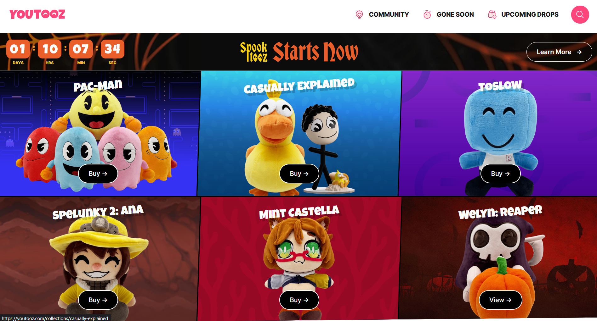
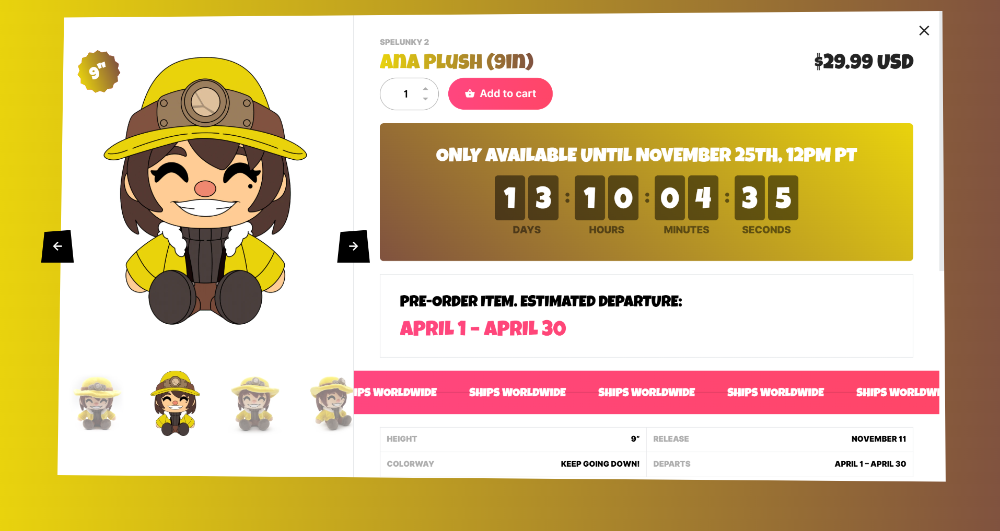
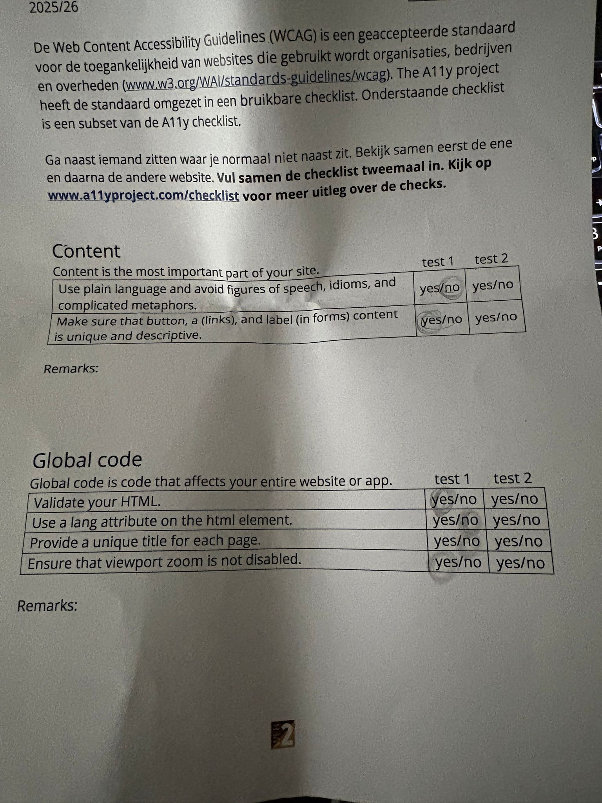
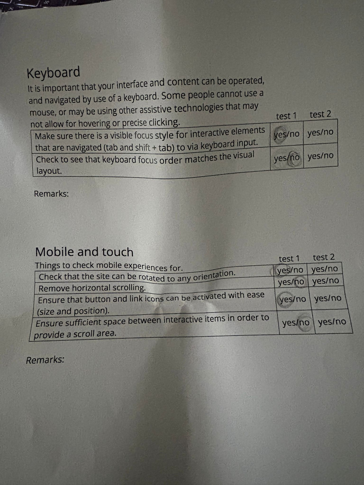
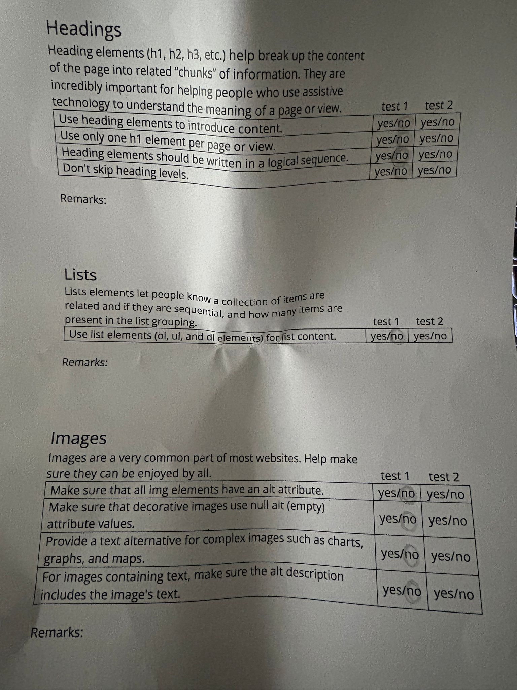
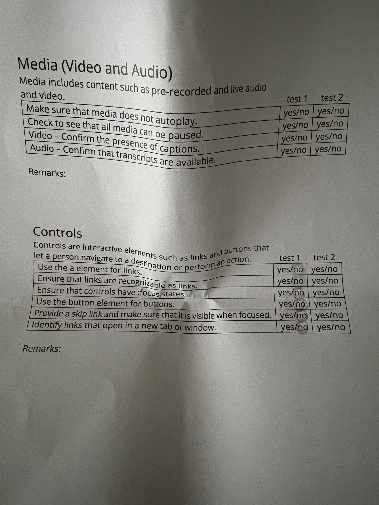
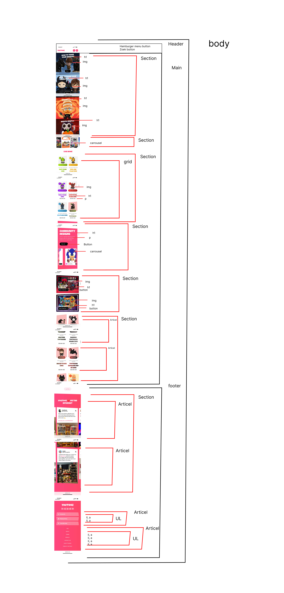
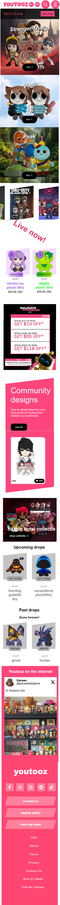
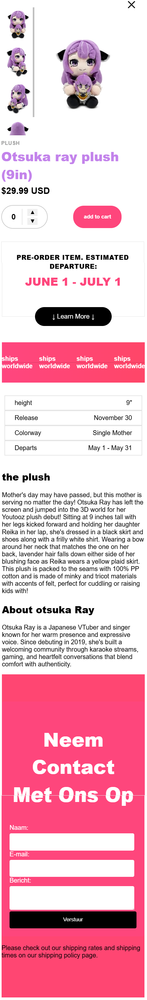

# Procesverslag
Markdown is een simpele manier om HTML te schrijven.  
Markdown cheat cheet: [Hulp bij het schrijven van Markdown](https://github.com/adam-p/markdown-here/wiki/Markdown-Cheatsheet).

Nb. De standaardstructuur en de spartaanse opmaak van de README.md zijn helemaal prima. Het gaat om de inhoud van je procesverslag. Besteedt de tijd voor pracht en praal aan je website.

Nb. Door *open* toe te voegen aan een *details* element kun je deze standaard open zetten. Fijn om dat steeds voor de relevante stuk(ken) te doen.

## Jij

  
uitwerken voor kick-off werkgroep

  ### Auteur:
  Jihane Zahhaf

  #### Je startniveau:
  Blauw

  #### Je focus:
  surface plane
 

## Je website

  
uitwerken voor kick-off werkgroep

  ### Je opdracht:
  https://youtooz.com/

  #### Screenshot(s) van de eerste pagina (small screen): 
  hier de naam van de pagina  
  

  #### Screenshot(s) van de tweede pagina (small screen):
  hier de naam van de pagina  
  
 

## Toegankelijkheidstest 1/2 (week 1)

  
uitwerken na test in 2e werkgroep

  
  ### Bevindingen
  Lijst met je bevindingen die in de test naar voren kwamen:
  Mijn grootste bevinding is dat mijn hele website bestaat uit divjes.Mijn hele website is ook erg moeilijk veel code is geschreven op een hele moeilijke manier. verder is het zeker niet semantisch. 
  Ze hebben ook geen light dark mode. Verder hebben is hun screenreader ook erg slecht meeste stukken worden niet voorgelezen. 
  
   
    
     
       

  

## Breakdownschets (week 1)

  
uitwerken na afloop 3e werkgroep

  ### de hele pagina: 
  

## Voortgang 1 (week 2)

  
uitwerken voor 1e voortgang

  ### Stand van zaken
  ik was nog niet begonnen met het coderen. MIjn feedback kreeg ik vooral op mijn breakdown schets. articals hoeven niet in sections. 

  ### Verslag van meeting
  hier na afloop snel de uitkomsten van de meeting vastleggen

  - Moet duidelijkere sections 
  - moet beginnen aan de code

## Voortgang 2 (week 3)

  
uitwerken voor 2e voortgang

  ### Stand van zaken
  ik ben pas begonnen met de code. ik heb de header en het begin stuk af maar het gehele html is nog niet compleet. 
  

  ### Agenda voor meeting

  ### Verslag van meeting
  Ik kreeg als feedback daat het handiger is om te beginnen met alles in html te zetten en daarna pas css te doen. 
  ik deed alles tegelijk wat niet handig was.
  
  - meer verdiepen in de oprachten zodat flex box goed werkt
  - verder gaan met de html

## Toegankelijkheidstest 2/2 (week 4)

  
uitwerken na test in 9e werkgroep

  ### Bevindingen
  Mijn website is veel semantischer dan de orginele website. ik heb veel meer betere code geschreven. 
  Ook makkelijkere code die makkelijker is dat die van de orginele website.
  ik heb amper divjes gerbuikt terwijl de orginele website er alleen maar heeft. 

## Voortgang 3 (week 4)

  
uitwerken voor 3e voortgang

  ### Stand van zaken
  Ik heb bijna alle html erin staan. ook een aantal javascript functies zoals de timer en de functie op de tweede pagina.
  ik heb ook een heleboel gedaan aan css. De pagina lijkt bijna op de orginele.
  

  ### Agenda voor meeting

  ### Verslag van meeting
  De feedback die ik heb gekregen is dat ik meer css moet toepassen op de footer en dat ik de html code moet verbeteren.
  de footer zat er niet goed in en ik heb section waar er divjes horen tte zijn.

  - Betere html schrijven
  - meer javascript
  - css verbetren vooral tweede pagina

## Eindgesprek (week 5)

  
uitwerken voor eindgesprek

  ### Je uitkomst - karakteristiek screenshots:
  Dit is mijn herkansings gesprek en dit is mijn uiteindelijke werk.
  
  dit is uiteindelijk mijn tweede pagina geworden
   
  

  ### Dit ging goed/Heb ik geleerd: 
  het ging erg goed om flexboc te gebruiken. best veel dingen zijn responsive ookal heb ik gekozen voor surface plane. verder vond ik dat de css erg goed ging.
  ik kon snel typen hoe ik iets wilde omdat ik het erg goed begreep.

  

  ### Dit was lastig/Is niet gelukt:
  Korte omschrijving met plaatjes

  

## Bronnenlijst

  
continu bijhouden terwijl je werkt

  Nb. Wees specifiek ('css-tricks' als bron is bijv. niet specifiek genoeg). 
  Nb. ChatGpT en andere AI horen er ook bij.
  Nb. Vermeld de bronnen ook in je code.

  1.  /* bron: chatgpt prompt "maak een afteller""*/ 
  2. /*bron chatgpt ik vroeg voor een bounce effect*/
  3. /* chatgpt hoe zorg ervooor dat de afbeeldingen die ik heb reageren op de klik en groot ernaast komen*/
  4. light dark mode /*bron: uit dlo*/
  5. form van https://www.w3schools.com/html/html_forms.asp
  6. loading effect bij de add to cart java script met behulpt van chatgpt 

